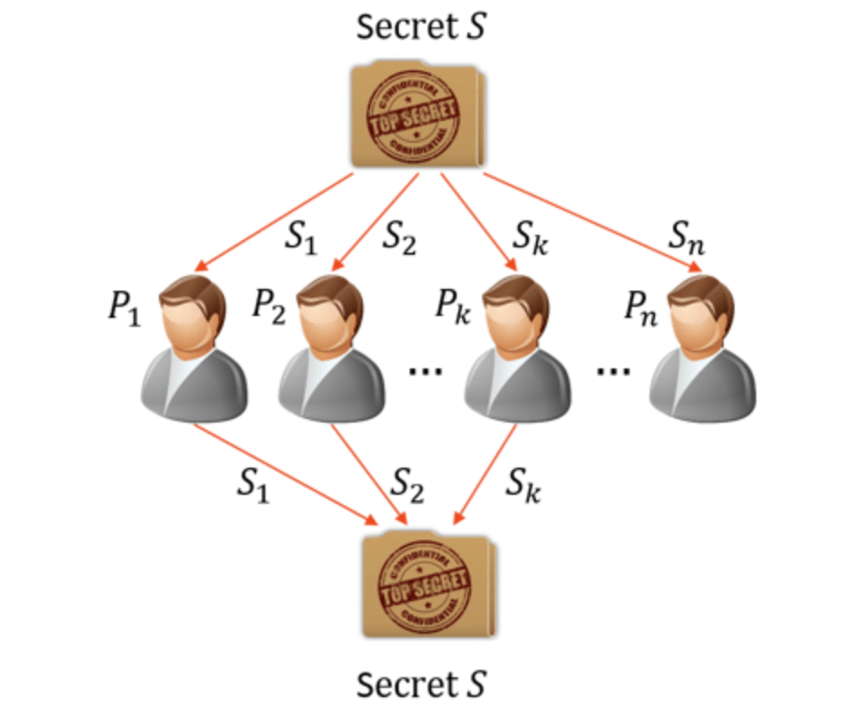
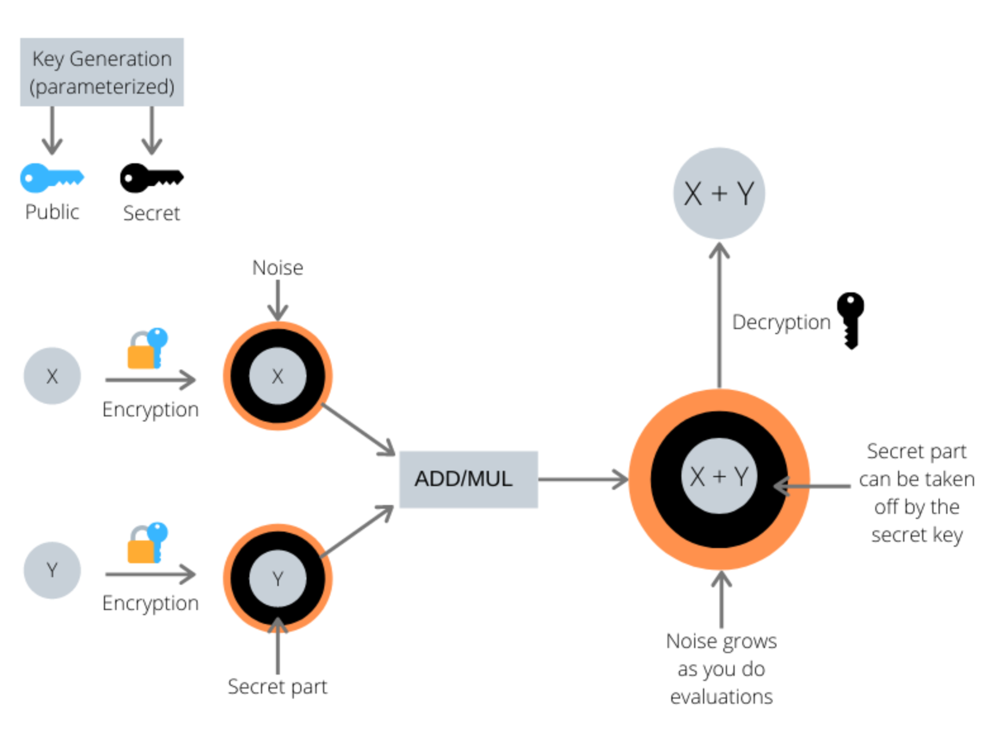

# Federated Learning

The FL architecture in it’s basic form consists of a curator or server that sits at its centre and coordinates the training activities

HyperLedger --> docs , outdated. Commands given by poeple not working. Googling and all stuff. Kuch steps tak help. No way to connect. Not scalable algorithm. 

# CryptoGraphic functions for private data sharing

### shamir secret sharing : 

Shamir's Secret Sharing is a cryptographic method that divides a secret into multiple parts, called shares. A minimum number of shares is required to reconstruct the original secret. 
The system is based on polynomial interpolation and offers a secure way to distribute and safeguard sensitive information. There is an implementation of the same present here. 
We shall/can use Shamir Secret sharing for consensus among several clients regarding correct updated Params sharing. 

### homomorphic encryption scheme : 
This is a cryptographic scheme that allows transfer of params in encrypted form. 
Allows arithematic operations on them in encrypted form and allows Decryption then to get the updated Params. 
There is an implementation of the same present here for Polynomial rings.
The main goal of an HE scheme is to compute on encrypted data but the catch with this scheme is that the amount of computation we can perform will depend on the chosen parameters, and there are no perfect parameters that work for all cases, we must choose them according to our scheme, the security we want to achieve and the computation you want to perform.

