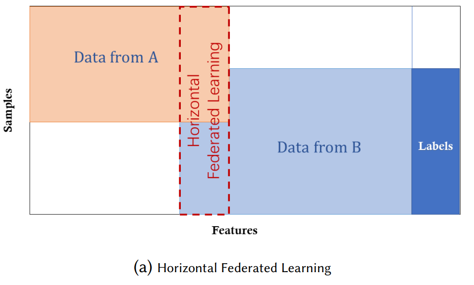
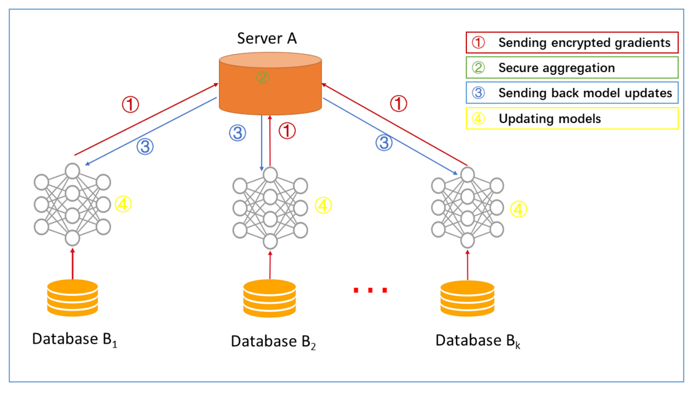

# Federated Learning

The FL architecture in it’s basic form consists of a curator or server that sits at its centre and coordinates the training activities. The main idea is to build machine learning models based on data sets that are distributed across multiple devices while preventing data leakage. 

However, In real world scenarios, where data originate from different organizational entities, covariate shift, prior probability shift, concept shift and unbalanced data size are common technical challenges. 

There are 3 types of Federated Learning, namely Horizontal, Vertical and Federated Transfer. 

For the implementation of GANs, Horizontal Federated Learning is an optimal choice because it is quite feasible to assume that different clients will share the same feature space but are different in samples. 

# Architecture of HFE

In this system, k participants with the same data structure collaboratively learn a machine learning model with the help of a parameter or cloud server. A typical assumption is that the participants are honest whereas the server is honest-but-curious, therefore no leakage of information from any participants to the server is allowed. The training process of such a system usually contain the following four steps:
• Step 1: participants locally compute training gradients, mask a selection of gradients with, differential privacy and send masked results to server;
• Step 2: Server performs secure aggregation without learning information about any participant;
• Step 3: Server send back the aggregated results to participants;
• Step 4: Participants update their respective model with the decrypted gradients.

